# TP — Architecture Microservices avec NestJS
> REST • GraphQL • gRPC • Kafka

---

## 📋 Table des matières

- [Architecture générale](#architecture-générale)
- [Services & Ports](#services--ports)
- [Prérequis](#prérequis)
- [Installation & Démarrage](#installation--démarrage)
- [catalog-service — REST](#catalog-service--rest)
- [stock-service — gRPC](#stock-service--grpc)
- [order-service — REST + gRPC + Kafka](#order-service--rest--grpc--kafka)
- [notification-service — Kafka Consumer](#notification-service--kafka-consumer)
- [query-service — GraphQL](#query-service--graphql)
- [Justification technique](#justification-technique)
- [Tests réalisés](#tests-réalisés)

---

## Architecture générale

```
Client HTTP
├── REST ───────> catalog-service (port 3001)
├── REST ───────> order-service (port 3002) ── gRPC ──> stock-service (port 5000)
│                     │
│                     └── Kafka topic: order.created ──> notification-service
└── GraphQL ────> query-service (port 3004) ── REST ──> catalog-service / order-service
```

---

## Services & Ports

| Service              | Port | Protocole           | Rôle                                    |
|----------------------|------|---------------------|-----------------------------------------|
| catalog-service      | 3001 | REST                | CRUD des produits                       |
| order-service        | 3002 | REST + gRPC + Kafka | Création et suivi des commandes         |
| stock-service        | 5000 | gRPC                | Validation et réservation du stock      |
| notification-service | —    | Kafka Consumer      | Consommation des événements de commande |
| query-service        | 3004 | GraphQL             | Lecture agrégée des données             |
| Kafka                | 9092 | —                   | Broker de messages                      |
| Zookeeper            | 2181 | —                   | Coordination Kafka                      |

---

## Prérequis

- Node.js 20+
- npm
- Nest CLI (`npm install -g @nestjs/cli`)
- Docker Desktop

---

## Installation & Démarrage

### 1. Démarrer Kafka & Zookeeper avec Docker

```bash
docker-compose up -d
```

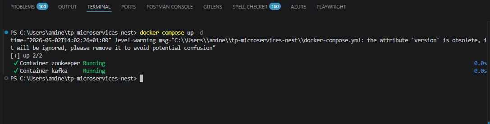

### Containers Docker en cours d'exécution

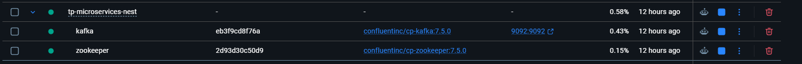

### 2. Démarrer chaque service

```bash
# Terminal 1 — catalog-service
cd catalog-service && npm install && npm run start:dev

# Terminal 2 — stock-service
cd stock-service && npm install && npm run start:dev

# Terminal 3 — order-service
cd order-service && npm install && npm run start:dev

# Terminal 4 — notification-service
cd notification-service && npm install && npm run start:dev

# Terminal 5 — query-service
cd query-service && npm install && npm run start:dev
```

### docker-compose.yml

```yaml
version: '3.8'
services:
  zookeeper:
    image: confluentinc/cp-zookeeper:7.5.0
    container_name: zookeeper
    environment:
      ZOOKEEPER_CLIENT_PORT: 2181
      ZOOKEEPER_TICK_TIME: 2000

  kafka:
    image: confluentinc/cp-kafka:7.5.0
    container_name: kafka
    depends_on:
      - zookeeper
    ports:
      - "9092:9092"
    environment:
      KAFKA_BROKER_ID: 1
      KAFKA_ZOOKEEPER_CONNECT: zookeeper:2181
      KAFKA_ADVERTISED_LISTENERS: PLAINTEXT://localhost:9092
      KAFKA_OFFSETS_TOPIC_REPLICATION_FACTOR: 1
      KAFKA_AUTO_CREATE_TOPICS_ENABLE: "true"
```

---

## catalog-service — REST

**Port:** `3001`

### Endpoints

| Méthode | Route         | Description          |
|---------|---------------|----------------------|
| POST    | /products     | Créer un produit     |
| GET     | /products     | Lister les produits  |
| GET     | /products/:id | Consulter un produit |
| PATCH   | /products/:id | Mettre à jour        |
| DELETE  | /products/:id | Supprimer un produit |

### Exemple de payload

```json
{
  "name": "Laptop",
  "price": 1200,
  "stock": 10
}
```

### Création d'un produit — POST /products

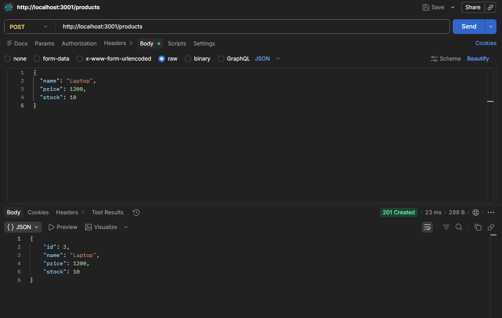

### Liste des produits — GET /products

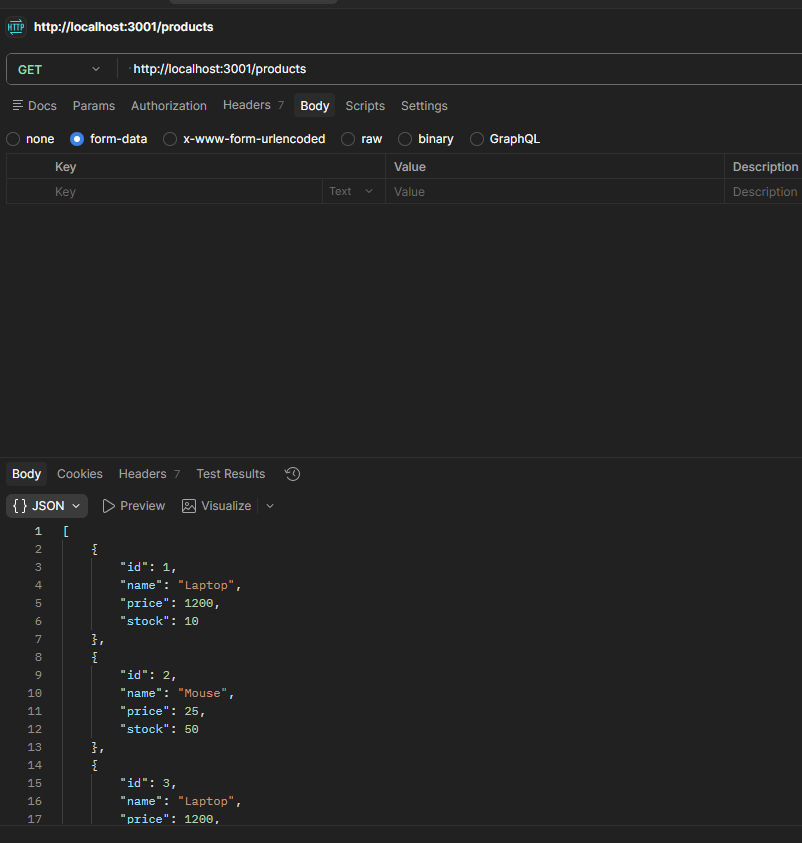

---

## stock-service — gRPC

**Port:** `5000`

### Contrat Protobuf (`stock.proto`)

```proto
syntax = "proto3";
package stock;

service StockService {
  rpc CheckAndReserve (StockRequest) returns (StockResponse);
}

message StockRequest {
  int64 productId = 1;
  int32 quantity  = 2;
}

message StockResponse {
  bool   available = 1;
  string message   = 2;
}
```

### stock-service démarré

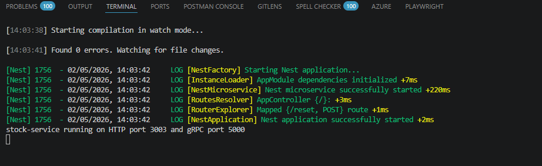

### Comportement

- Retourne `available: true` si le stock est suffisant et le réserve
- Retourne `available: false` avec un message explicite si stock insuffisant

---

## order-service — REST + gRPC + Kafka

**Port:** `3002`

### Flux métier

```
POST /orders
  │
  ├─ 1. Appel gRPC → stock-service.CheckAndReserve()
  ├─ 2. Si stock insuffisant → HTTP 409 Conflict
  ├─ 3. Enregistrement de la commande (status: confirmed)
  └─ 4. Emission Kafka → topic: order.created
```

### Endpoints

| Méthode | Route       | Description            |
|---------|-------------|------------------------|
| POST    | /orders     | Créer une commande     |
| GET     | /orders     | Lister les commandes   |
| GET     | /orders/:id | Consulter une commande |

### order-service démarré

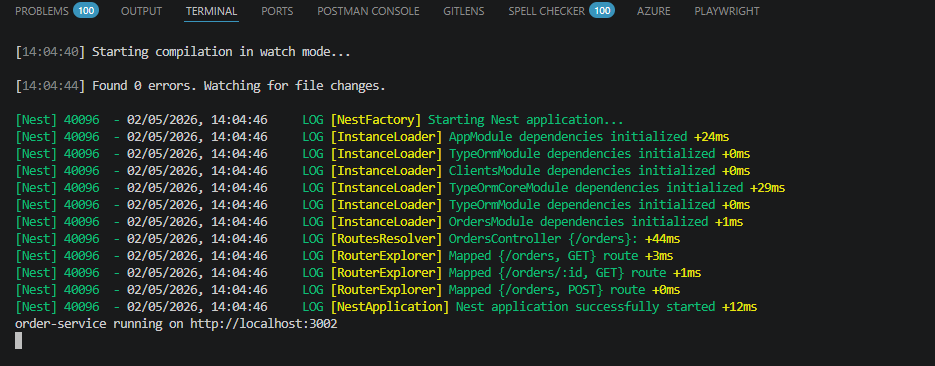

### Commande valide — POST /orders → 201 Created

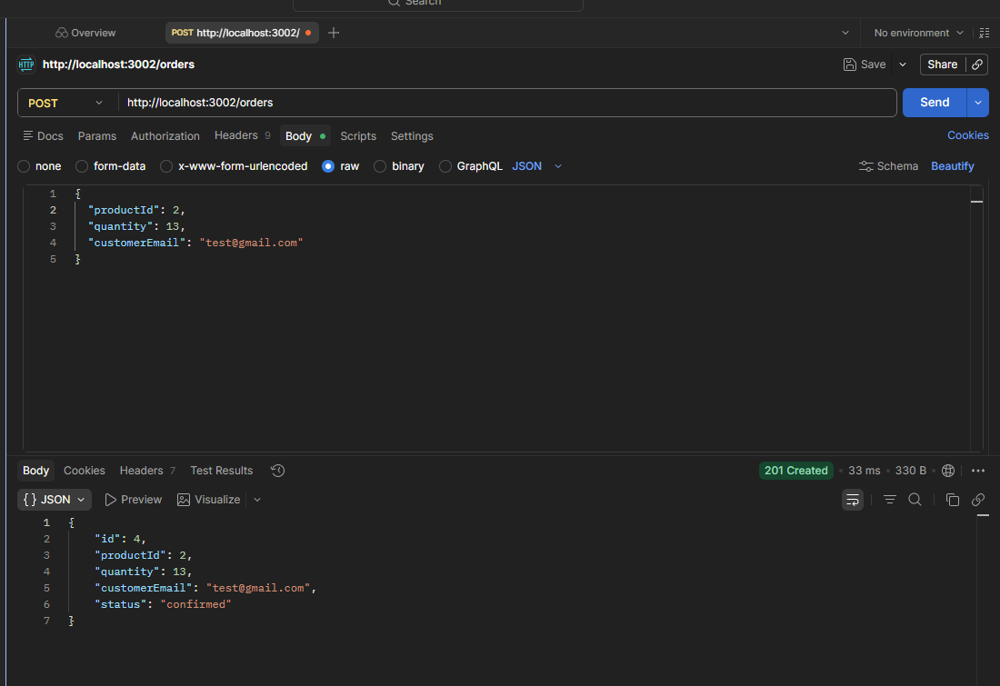

---

## notification-service — Kafka Consumer

**Topic écouté:** `order.created`  
**Group ID:** `notification-consumer`

### Comportement

- Écoute le topic `order.created` via Kafka
- Journalise l'événement reçu avec un horodatage
- Simule l'envoi d'une confirmation par email

### notification-service démarré & événement consommé

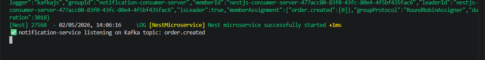

### Exemple de sortie

```
✅ notification-service listening on Kafka topic: order.created
[AppController] ✅ Confirmation envoyée à test@gmail.com pour la commande #4
   → Produit: 2 | Quantité: 13 | Statut: confirmed
```

---

## query-service — GraphQL

**Port:** `3004`  
**Playground:** http://localhost:3004/graphql

### Schéma GraphQL

```graphql
type Product {
  id: ID!
  name: String!
  price: Float!
  stock: Int!
}

type Order {
  id: ID!
  productId: ID!
  quantity: Int!
  status: String!
  customerEmail: String!
}

type Query {
  products: [Product!]!
  orders: [Order!]!
  orderById(id: ID!): Order
}
```

### query-service démarré

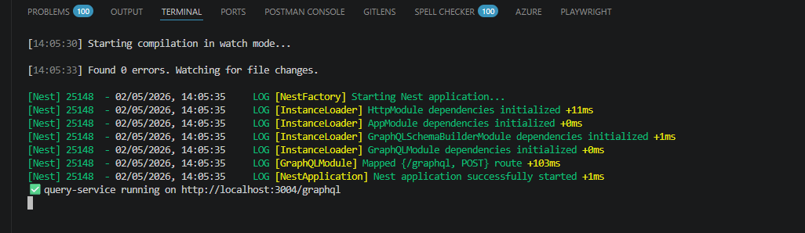

### GraphQL Playground — Query products

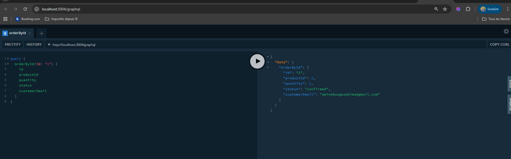

### GraphQL Playground — Query orders

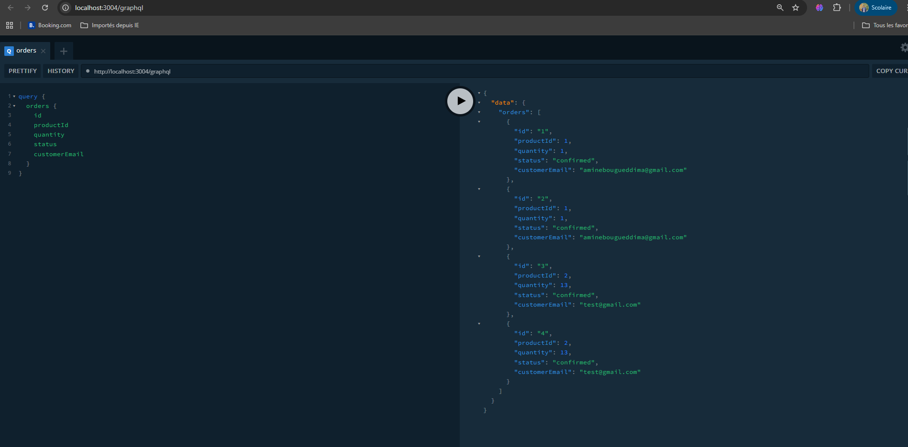

### GraphQL Playground — Query orderById

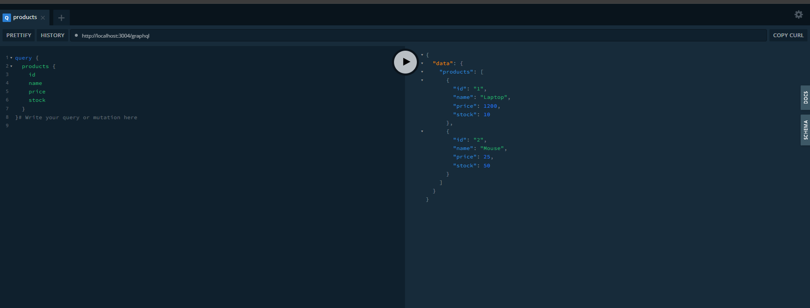

---

## Justification technique

| Technologie | Rôle dans ce projet | Pourquoi ce choix |
|-------------|---------------------|-------------------|
| **REST** | CRUD produits et commandes | Simple et universel, idéal pour des opérations CRUD exposées à des clients HTTP. Facile à tester via Postman. |
| **gRPC** | Validation synchrone du stock | Communication inter-services rapide et typée via Protobuf. Parfait pour un appel synchrone où la réponse est immédiatement nécessaire avant de continuer le flux. |
| **Kafka** | Événement commande créée | Communication asynchrone et découplée. La notification n'a pas besoin d'être immédiate — Kafka garantit la livraison sans bloquer order-service. Permet une scalabilité indépendante. |
| **GraphQL** | Lecture agrégée des données | Permet au client de demander exactement les champs dont il a besoin en une seule requête, en agrégeant des données de plusieurs services. Évite le sur-fetching et le sous-fetching. |

---

## Tests réalisés

| # | Test | Résultat |
|---|------|----------|
| 1 | Démarrage de Kafka & Zookeeper via Docker | ✅ Containers Running |
| 2 | Démarrage de tous les services NestJS | ✅ Tous sur leurs ports respectifs |
| 3 | Créer une commande valide (POST /orders) | ✅ 201 Created, gRPC OK, Kafka émis |
| 4 | Vérifier les logs notification-service | ✅ Event Kafka consommé, confirmation affichée |
| 5 | Query GraphQL `products` | ✅ Laptop & Mouse retournés |
| 6 | Query GraphQL `orders` | ✅ 4 commandes retournées |
| 7 | Query GraphQL `orderById` | ✅ Commande #1 retournée |

---

## Arborescence du projet

```
tp-microservices-nest/
├── catalog-service/
├── notification-service/
├── order-service/
├── query-service/
├── stock-service/
├── screenshots/
│   ├── comand_to_up_container.png
│   ├── running_container_docker.png
│   ├── runnig_stock-service.png
│   ├── runnig_order-service.png
│   ├── runnig_query-service.png
│   ├── running_notification-service.png
│   ├── postman_endpoint.png
│   ├── trygraph-ql.png
│   ├── get_all_order_graph-ql.png
│   └── get_element.png
├── docker-compose.yml
└── README.md
```
